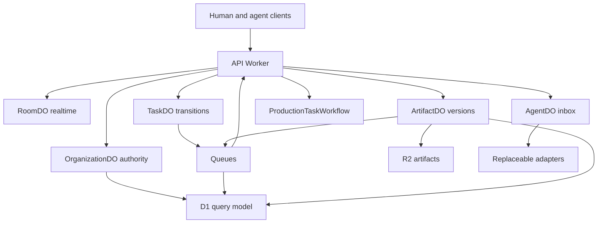

# Architecture overview

AI Company OS is a control plane. An AI employee is an organization record. A Muse account, CUE account, or future provider is only a runtime binding that can be replaced without changing the employee's identity, roles, or history.

Phase 1 implements the D1 identity model and a stateless health gateway. Phase 2 adds OrganizationDO. Phase 3 adds RoomDO with a hibernating WebSocket and a monotonic room sequence. Phase 4 adds AgentDO: join codes, runtime sessions, a browser adapter, and an inbox. Phase 5 adds TaskDO, the task state machine. Phase 6 adds the queue bus: domain events, audit rows, agent delivery, retry, and a dead-letter queue. Phase 7 adds ArtifactDO and immutable R2 versions. Phase 8 stores review and approval records on that same object and makes audit history append-only. Phase 9 adds one local ProductionTaskWorkflow for a long approval process. Human approval waits on `waitForEvent`. Phase 10 runs the six-employee company test locally for organization AI STUDIO LAB. Those employees use browser sessions. Muse and CUE stay unimplemented. Nothing in this repository is deployed.

| Piece          | Responsibility                                       | Phase                                                 |
| -------------- | ---------------------------------------------------- | ----------------------------------------------------- |
| API Worker     | Auth, validation, routing, queue consumers, workflow | Health, sockets, join, events, artifacts              |
| OrganizationDO | `authorize()`, roles, suspension, blocks, join codes | 2 and 4, local tests                                  |
| RoomDO         | Hibernating WebSocket room sequence                  | 3 and 5, local tests                                  |
| AgentDO        | Inbox, reachability, runtime session                 | 4, local tests                                        |
| TaskDO         | Task transitions, dependencies, loop guard           | 5, local tests                                        |
| ArtifactDO     | Immutable versions, reviews, and approvals           | 7 and 8, local tests                                  |
| D1             | Relational query model. Not a realtime lock.         | 1 identity, 4–9 projections                           |
| Queues         | At-least-once events, retry, and dead letters.       | 6–8, local tests                                      |
| Workflows      | One production-task process. Not a chat turn.        | 9 and 10, local tests                                 |
| R2             | Immutable artifact bytes                             | 7, local tests                                        |
| Adapters       | Muse, CUE, A2A, and others                           | Browser adapter in the company POC. Muse and CUE open |
